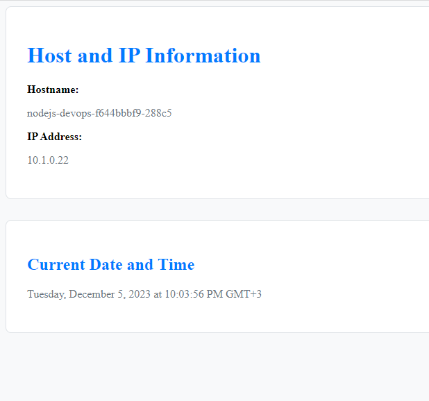

# DevOps - Node.js Example

This project was created to better understand DevOps with Docker and Kubernetes examples. The main purpose of the application is to see the IP address and machine name of the machine on which it is running.

## Getting Started

These instructions will guide you on how to run the project locally, deploy it using Docker, and deploy it on Kubernetes.

### Prerequisites

To run this project, the following software needs to be installed:

- [Node.js](https://nodejs.org/)
- [Docker](https://www.docker.com/)
- [Docker Compose](https://docs.docker.com/compose/) (optional, only if running on Docker)

### Installation

1. Navigate to the project directory:

    ```bash
    cd devops-nodejs-example
    ```

2. Install the required npm packages:

    ```bash
    npm install
    ```

3. Start the application:

    ```bash
    npm start
    ```

    The application will now be running at [http://localhost:3000](http://localhost:3000).

## Running with Docker

1. Build the Docker image:

    ```bash
    docker build -t nodejs-app:latest .
    ```

2. Start the Docker container:

    ```bash
    docker run -p 3000:3000 -d nodejs-app:latest
    ```

    The application will now be running at [http://localhost:3000](http://localhost:3000).

## Running with Kubernetes

1. Connect to a Kubernetes cluster.

2. Deploy the application using the YAML files in the `kubernetes` directory:

    ```bash
    kubectl apply -f kubectl apply -f deploys/kubernetes/yaml/
    ```

    The application will now be running on your Kubernetes cluster.

## Screenshots



## License

This project is licensed under the MIT License - see the [LICENSE](LICENSE) file for details.

## Issues, Feature Requests or Support
Please use the [New Issue](https://github.com/akinbicer/devops-nodejs-example/issues/new) button to submit issues, feature requests or support issues directly to me. You can also send an e-mail to akin.bicer@outlook.com.tr.
